# 시스템 아키텍처

> AI Agent Core Framework의 전체 시스템 구조, 핵심 컴포넌트, 데이터 흐름 및 확장 포인트를 정의합니다.

---

## 📋 목차

- [전체 시스템 구조](#-전체-시스템-구조)
- [핵심 컴포넌트](#-핵심-컴포넌트)
- [데이터 흐름도](#-데이터-흐름도)
- [플러그인 아키텍처](#-플러그인-아키텍처)
- [확장 포인트](#-확장-포인트)

---

## 🏗️ 전체 시스템 구조

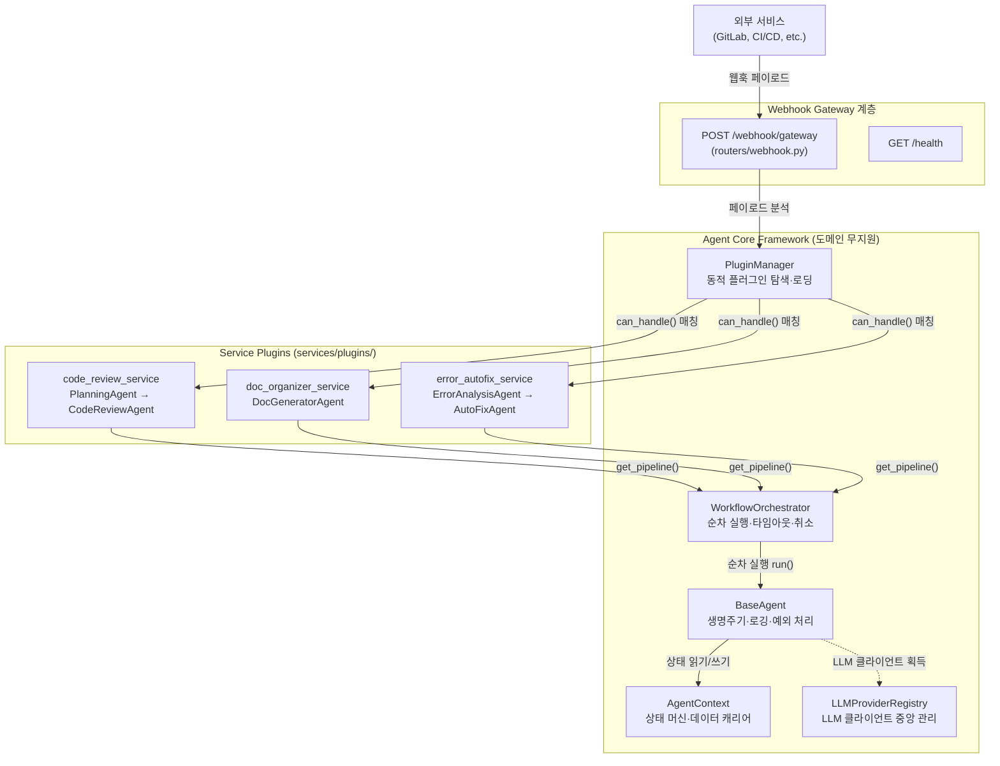

### 계층 분리 원칙

| 계층 | 역할 | 비즈니스 지식 |
|------|------|--------------|
| **Gateway** | 외부 요청 수신 및 응답 | 없음 |
| **Core** | 생명주기·워크플로우·상태 관리 | 없음 |
| **Plugins** | 실제 비즈니스 로직 (도메인 특화) | 있음 |

코어는 어떤 서비스(GitLab 리뷰, 문서화 등)가 동작 중인지 알지 못합니다. 오직 `ServicePlugin` 규격과 `BaseAgent` 규격만을 이해합니다.

---

## 🔩 핵심 컴포넌트

### 1. BaseAgent (에이전트 공통 뼈대)

**파일:** `core/agent/base_agent.py`

모든 서비스 에이전트가 상속받아야 하는 추상 클래스입니다. **템플릿 메서드 패턴**을 적용하여 공통 로직을 `run()` 메서드에 집중시킵니다.

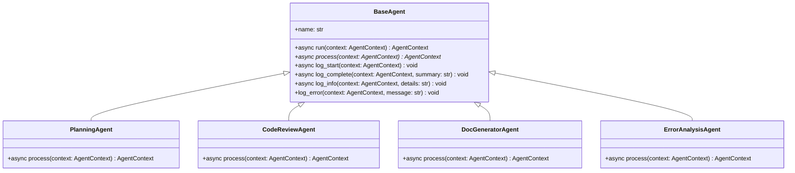

#### `run()` 메서드 실행 흐름

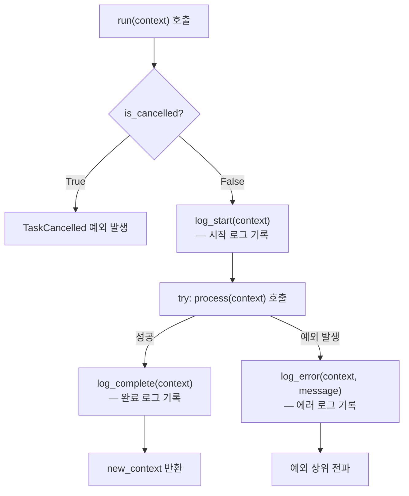

#### 핵심 설계 포인트

- 개발자는 `process()` 추상 메서드만 구현하면 됨
- 실행 전 취소 플래그(`is_cancelled`) 자동 체크
- 시작/완료/에러 로그가 `context.history`에 자동 누적
- 예외 발생 시 상위 오케스트레이터로 버블링

---

### 2. AgentContext (상태 머신 데이터 캐리어)

**파일:** `core/agent/context.py`

에이전트 파이프라인 전반을 거치며 흐르는 동적 공유 상태 객체입니다. Pydantic `BaseModel`을 기반으로 합니다.

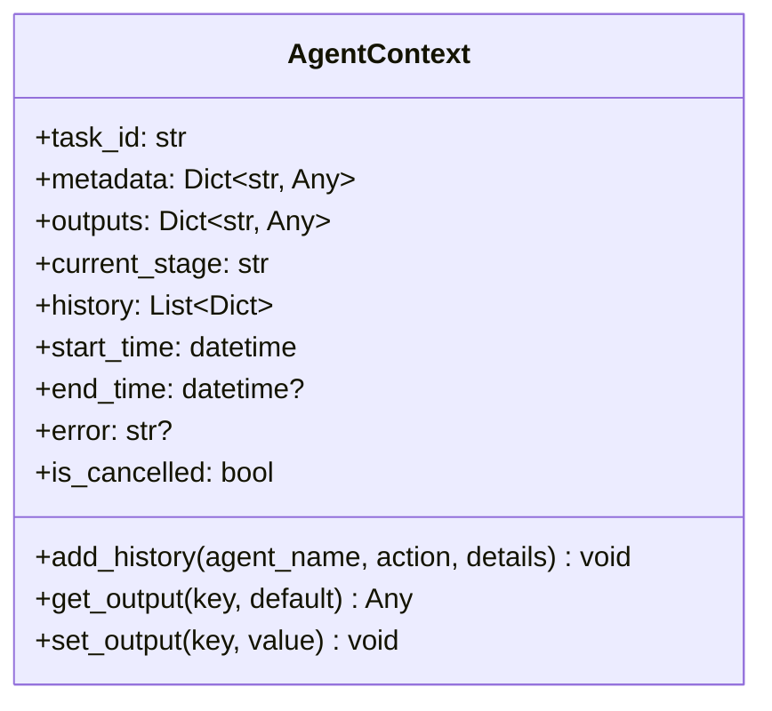

| 필드 | 타입 | 용도 |
|------|------|------|
| `task_id` | `str` | 작업 고유 식별자 (UUID 기반 8자리, 로그 추적용) |
| `metadata` | `Dict[str, Any]` | 웹훅 원본 페이로드 및 초기 설정 데이터 |
| `outputs` | `Dict[str, Any]` | 에이전트 간 결과물 전달 공간 |
| `current_stage` | `str` | 현재 실행 중인 에이전트명 |
| `history` | `List[Dict]` | 실행 이력 (타임스탬프, 에이전트명, action, details) |
| `start_time` | `datetime` | 워크플로우 시작 시각 |
| `end_time` | `datetime?` | 워크플로우 종료 시각 |
| `error` | `str?` | 실행 중 발생한 에러 메시지 |
| `is_cancelled` | `bool` | 사용자 취소 요청 플래그 |

#### 데이터 전달 패턴

에이전트 간 결합을 최소화하기 위해, 오직 `outputs` 딕셔너리를 통해서만 데이터를 주고받습니다.

```
PlanningAgent                    CodeReviewAgent
     │                                │
     │  context.set_output(           │  context.get_output(
     │      "review_files", [...])    │      "review_files")
     │                                │
     └──────── outputs ───────────────┘
                  │
          AgentContext (공유 상태)
```

---

### 3. WorkflowOrchestrator (파이프라인 실행 엔진)

**파일:** `core/workflow/orchestrator.py`

주입받은 에이전트 리스트를 순차적으로 실행하는 코어 엔진입니다.

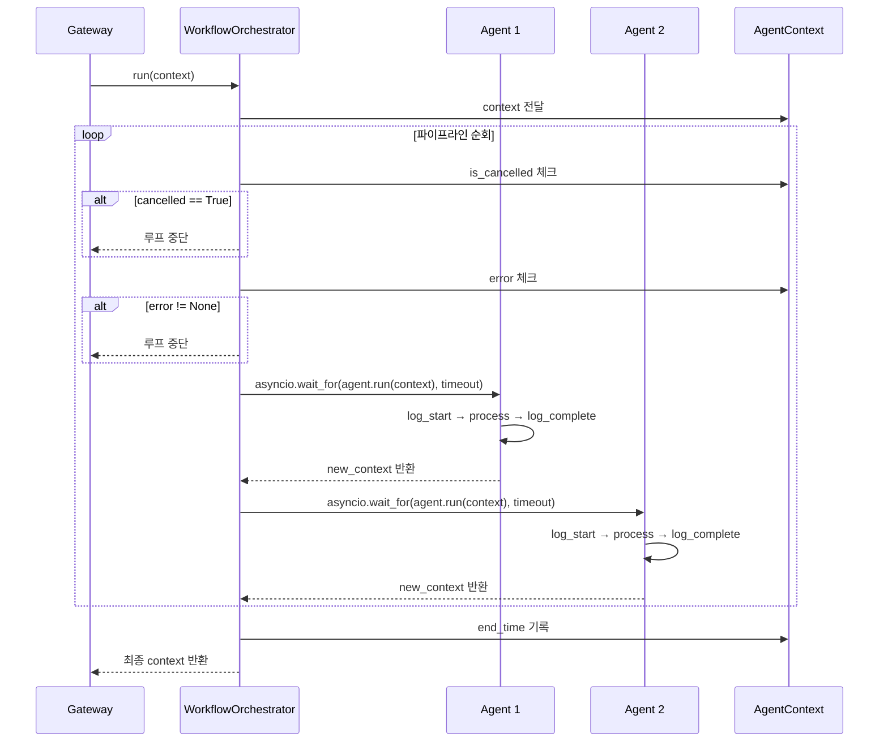

#### 안전 장치

| 장치 | 동작 |
|------|------|
| **취소 감지** | 각 에이전트 실행 전 `context.is_cancelled` 확인 → True 시 즉시 중단 |
| **에러 전파 감지** | 각 에이전트 실행 전 `context.error` 확인 → 존재 시 중단 |
| **개별 타임아웃** | `asyncio.wait_for(agent.run(context), timeout=default_timeout)` — 기본 300초 |
| **백그라운드 서브에이전트** | `run_background_subagent()`로 메인 파이프라인을 블로킹하지 않는 비동기 태스크 실행 |

---

### 4. Plugin System (동적 플러그인 아키텍처)

**파일:** `core/plugin.py`, `core/plugin_manager.py`

#### ServicePlugin 추상 클래스

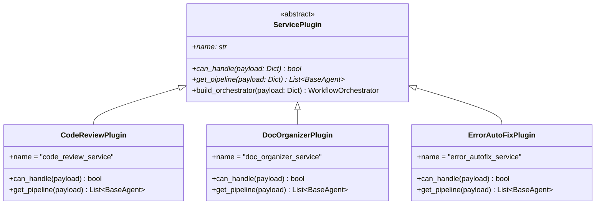

#### PluginManager 동적 로딩 순서

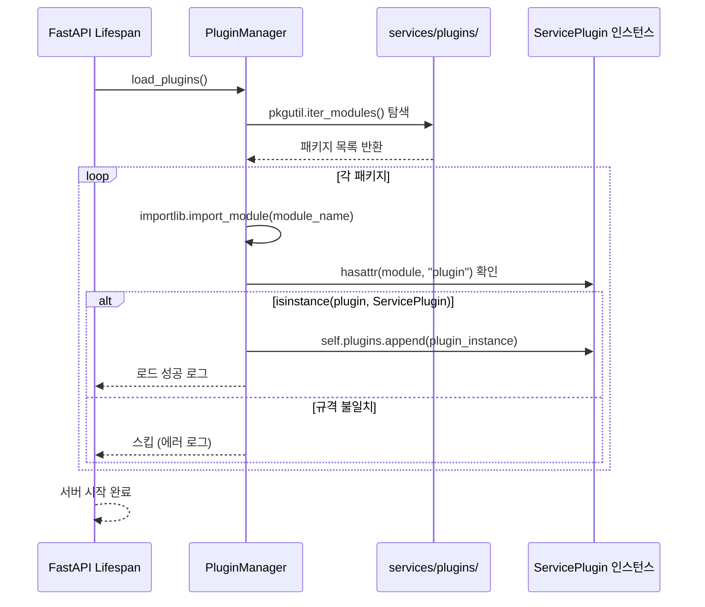

#### 규격 계약

새 플러그인이 로드되기 위한 필수 조건:

1. `services/plugins/` 하위의 패키지 디렉토리에 위치
2. `__init__.py` 내부에 `plugin`이라는 이름의 전역 변수 선언
3. 해당 변수가 `ServicePlugin` 클래스의 인스턴스여야 함
4. 다음 3개 추상 메서드를 모두 구현해야 함:
   - `name` (property): 플러그인 식별명 반환
   - `can_handle(payload)`: 페이로드 처리 가능 여부 반환
   - `get_pipeline(payload)`: 에이전트 파이프라인 리스트 반환

---

### 5. LLMProviderRegistry (LLM 클라이언트 중앙 관리)

**파일:** `core/provider/registry.py`

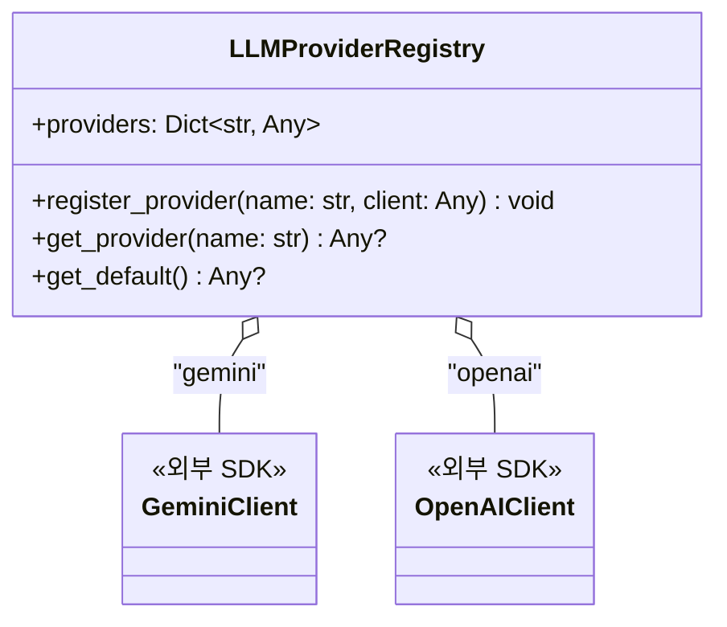

에이전트가 직접 API 키를 가지거나 클라이언트를 초기화하지 않도록 중앙 관리하는 레지스트리입니다. 싱글톤 인스턴스(`llm_registry`)로 전역 접근합니다.

---

### 6. Unified Webhook Gateway (단일 API 진입점)

**파일:** `routers/webhook.py`

```mermaid
flowchart LR
    WH["POST /webhook/gateway"] --> Parse["JSON 페이로드 파싱"]
    Parse --> Match["plugin_manager.get_handler_for_payload(payload)"]
    Match --> Loop["등록된 플러그인 순회\ncan_handle(payload) 호출"]
    Loop -->|"매칭됨"| Build["AgentContext 생성\ntask_id = UUID[:8]"]
    Loop -->|"매칭 없음"| Ignore[''"status": "ignored"''']
    Build --> BG["orchestrator = plugin.build_orchestrator(payload)"]
    BG --> AddTask["background_tasks.add_task(orchestrator.run, context)"]
    AddTask --> Respond[''"status": "accepted",\n"task_id": task_id''']
```

**핵심 특징:** 웹훅 수신 즉시 `HTTP 202 Accepted`를 반환하고, 실제 에이전트 파이프라인은 FastAPI의 `BackgroundTasks`를 통해 비동기로 실행됩니다. 이를 통해 웹훅 타임아웃을 방지합니다.

---

## 🔄 데이터 흐름도

### 전체 웹훅 처리 시퀀스 (GitLab MR 코드 리뷰 예시)

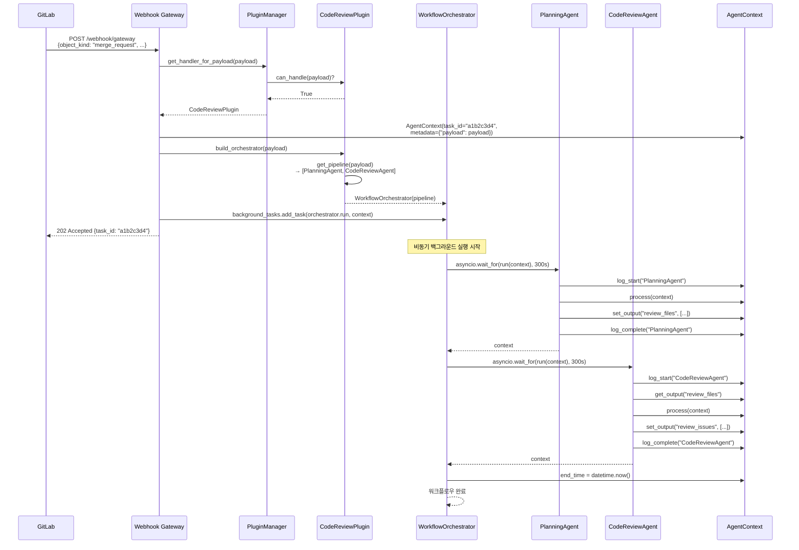

### 컨텍스트 상태 변화

| 단계 | `current_stage` | `outputs` | `history` |
|------|-----------------|-----------|-----------|
| **초기** | `"init"` | `{}` | `[]` |
| **PlanningAgent 시작** | `"PlanningAgent"` | `{}` | `[{agent: "PlanningAgent", action: "started"}]` |
| **PlanningAgent 완료** | `"PlanningAgent"` | `{"review_files": [...]}` | `[..., {agent: "PlanningAgent", action: "completed"}]` |
| **CodeReviewAgent 완료** | `"CodeReviewAgent"` | `{"review_files": [...], "review_issues": [...]}` | `[..., {agent: "CodeReviewAgent", action: "completed"}]` |

---

## 🧩 플러그인 아키텍처

### 클래스 구조도

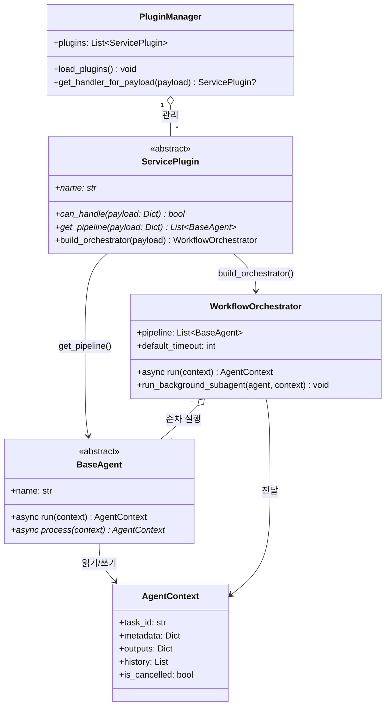

### 플러그인 등록 및 라우팅 흐름

```mermaid
flowchart TD
    subgraph "서버 시작 시 (Lifespan)"
        L1["plugin_manager.load_plugins()"] --> L2["services/plugins/ 디렉토리 스캔"]
        L2 --> L3["각 패키지 importlib.import_module()"]
        L3 --> L4{"module.plugin 이\nServicePlugin 인가?"}
        L4 -->|"Yes"| L5["self.plugins.append(instance)"]
        L4 -->|"No"| L6["스킵 + 에러 로그"]
    end

    subgraph "웹훅 수신 시 (Runtime)"
        R1["POST /webhook/gateway"] --> R2["payload 파싱"]
        R2 --> R3["plugin_manager.get_handler_for_payload(payload)"]
        R3 --> R4["등록된 plugins 순회"]
        R4 --> R5{"plugin.can_handle(payload)\n== True?"}
        R5 -->|"매칭"| R6["해당 플러그인 선택"]
        R5 -->|"매칭 안됨"| R7["status: ignored 응답"]
        R6 --> R8["build_orchestrator(payload)"]
        R8 --> R9["BackgroundTasks로 실행"]
        R9 --> R10["status: accepted 응답"]
    end
```

### 기본 제공 플러그인 상세

#### Code Review Plugin (`code_review_service`)

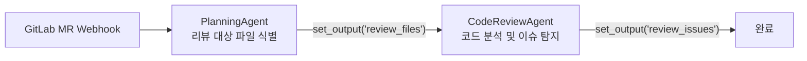

- **트리거 조건:** `payload.object_kind == "merge_request"`
- **파이프라인:** `PlanningAgent` → `CodeReviewAgent`
- **출력 데이터:**
  - `review_files`: 리뷰 대상 파일 리스트
  - `review_issues`: 파일별 이슈 정보 리스트

#### Doc Organizer Plugin (`doc_organizer_service`)

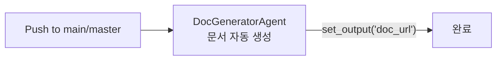

- **트리거 조건:** `payload.object_kind == "push"` && `ref in [main, master]`
- **파이프라인:** `DocGeneratorAgent`
- **출력 데이터:** `doc_url` (생성된 문서 URL)

#### Error AutoFix Plugin (`error_autofix_service`)

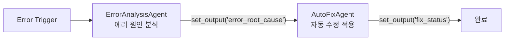

- **트리거 조건:** `payload.event_type == "error_trigger"`
- **파이프라인:** `ErrorAnalysisAgent` → `AutoFixAgent`
- **출력 데이터:**
  - `error_root_cause`: 분석된 에러 원인
  - `fix_status`: 수정 적용 결과

---

## 🔗 확장 포인트

### 1. 새 서비스 플러그인 추가

**위치:** `services/plugins/<new_service>/`

새 디렉토리에 `__init__.py`와 `agents/` 폴더를 생성하고, `ServicePlugin` 규격을 충족하는 인스턴스를 `plugin` 변수로 내보내면 됩니다. **코어 코드 수정 불필요.**

### 2. 새 에이전트 추가

기존 플러그인의 `get_pipeline()` 반환 리스트에 새 `BaseAgent` 상속 클래스를 끼워 넣기만 하면 됩니다.

```python
def get_pipeline(self, payload: Dict[str, Any]) -> List[BaseAgent]:
    return [
        PlanningAgent(name="PlanningAgent"),
        NewAnalysisAgent(name="NewAnalysisAgent"),  # 새 에이전트 추가
        CodeReviewAgent(name="CodeReviewAgent"),
    ]
```

### 3. 새 LLM 프로바이더 등록

서버 시작 시점(`lifespan` 시작부)에 `LLMProviderRegistry`에 새 클라이언트를 등록할 수 있습니다.

```python
from core.provider.registry import llm_registry

llm_registry.register_provider("ollama", ollama_client)
llm_registry.register_provider("claude", anthropic_client)
```

에이전트 내부에서 사용:

```python
client = llm_registry.get_provider("ollama")
```

### 4. 외부 서비스 연동 인터페이스 확장

`standard_interfaces_spec.md`에 정의된 추상 인터페이스를 구현하여 새 외부 서비스 어댑터를 추가할 수 있습니다.

| 인터페이스 | 메서드 | 구현 예 |
|-----------|--------|---------|
| `BaseRepositoryService` | `get_merge_request_diff()`, `post_mr_comment()` | GitLabService, GitHubService |
| `BaseWikiService` | `publish_page()` | ConfluenceService, NotionService |
| `BaseNotificationService` | `send_status_alert()` | SlackService, TeamsService |

### 5. 백그라운드 서브에이전트

`WorkflowOrchestrator.run_background_subagent()`를 사용하여 메인 파이프라인의 응답 속도에 영향을 주지 않고 비동기 후처리를 실행할 수 있습니다.

```python
orchestrator.run_background_subagent(
    RetrospectiveAgent(name="RetrospectiveAgent"),
    context
)
```

---

## 📐 설계 원칙 요약

| 원칙 | 적용 방식 |
|------|----------|
| **개방-폐쇄 원칙 (OCP)** | 새 플러그인 추가 시 코어 수정 불필요 (`importlib` 동적 로딩) |
| **의존성 역전 (DIP)** | 코어가 구체 클래스가 아닌 추상 클래스(`BaseAgent`, `ServicePlugin`)에 의존 |
| **단일 책임 원칙 (SRP)** | 코어=실행 제어, 플러그인=비즈니스 로직, 명확한 분리 |
| **템플릿 메서드 패턴** | `BaseAgent.run()`이 공통 흐름을 정의, `process()`만 개별 구현 |
| **전략 패턴** | `can_handle()`로 런타임에 처리 전략(플러그인)을 동적 선택 |
| **싱글톤 패턴** | `plugin_manager`, `llm_registry` 전역 인스턴스로 일관성 보장 |
