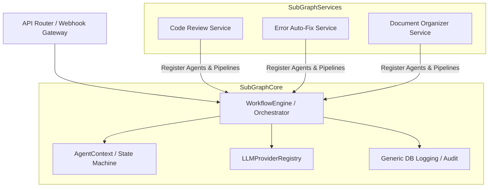

# AI Dev Agent 코어 프레임워크 분리 및 서비스 플러그인 아키텍처 도입 계획서

현재 `ai-dev-agent` 프로젝트는 GitLab 웹훅과 사내 특정 프로젝트 규칙(esign2 백엔드/프론트엔드)에 맞춰 코드 리뷰 및 자동 수정 작업을 수행하도록 **정적으로 강결합(Static Coupling)**되어 있습니다.

본 계획은 기존 코드를 직접 수정하는 대신, **새로운 프로젝트(`C:\Users\3870\.gemini\antigravity\scratch\ai-agent-core`)를 생성하여** 에이전트의 **코어 기능(상태 머신, 에이전트 베이스, LLM 라우팅, 오케스트레이터, 감사 로그)**을 독립적인 프레임워크 코어(Core)로 추출하고, 개별 기능(코드 리뷰, 오류 감지/수정, 문서 생성 등)을 독립적인 **서비스 플러그인(Service Plugins)**으로 장착하여 확장 및 변경에 매우 유연한 구조로 전면 리팩토링 및 재구축하는 상세 설계안입니다.

---

## User Review Required

> [!IMPORTANT]
> **핵심 아키텍처 설계 결정 사항**
> 1. **제네릭 컨텍스트(`Generic Context`) 도입**: 기존의 `WorkflowState`는 `review_plan`, `fix_result` 등 특정 리뷰 작업용 데이터 구조를 하드코딩하고 있었습니다. 이를 모든 서비스에서 데이터를 유연하게 담을 수 있도록 `Dict[str, Any]` 형태의 동적 데이터 필드와 제네릭 데이터 모델을 적용한 `AgentContext`로 전면 개편합니다.
> 2. **플러그인 기반 파이프라인 동적 등록**: `Orchestrator`가 코드 레벨에서 정적 에이전트 체인(`PlanningAgent` -> `ReviewAgent` -> ...)을 생성하는 대신, 활성화할 서비스 플러그인이 로드되면 해당 서비스가 정의한 파이프라인 명세(에이전트 목록 및 실행 조건)를 오케스트레이터가 동적으로 조율하도록 개선합니다.
> 3. **데이터베이스 스키마 확장**: 현재 `code_review_log`, `auto_fix_task` 등으로 세분화된 테이블을, 제네릭한 `agent_task` 및 `agent_step_log` 구조로 단일화/추상화하거나 뷰를 연동하여 특정 서비스 종속성을 낮출 것입니다.

---

## Open Questions

> [!WARNING]
> **설계 의도 및 도메인 구체화 (결정 사항)**
> 1. **서비스별 데이터 격리**: 코어 프레임워크는 제네릭한 `agent_task` 및 `agent_step_log` 테이블 구조를 제공하여 공통 상태와 메타데이터를 관리하고, 각 서비스 플러그인은 필요 시 자신만의 독립적인 테이블(예: `review_specific_data`)을 추가로 구성할 수 있도록 **하이브리드 스키마**를 채택합니다.
> 2. **API 및 웹훅 게이트웨이**: 단일 `/webhook/gateway` 진입점을 제공하여, 들어오는 페이로드를 분석(Payload Analyzer)한 뒤 적절한 서비스 플러그인으로 라우팅하는 **단일 게이트웨이 방식**을 채택합니다.
> 3. **서브에이전트 동작 모드**: 메인 오케스트레이터 내에 `BackgroundTaskManager`를 도입하여, 회고 에이전트 등 메인 파이프라인의 응답을 블로킹하지 않고 비동기적으로 실행되어야 하는 서브에이전트들을 코어 레벨에서 관리합니다.

---

## Proposed Changes

새로운 시스템 구조는 다음과 같은 구조적 컴포넌트로 나뉘게 됩니다:

---

### [Component 1] Agent Core (`core/`)
모든 서비스의 에이전트들이 공통으로 준수해야 할 추상화 계층 및 인프라스트럭처 모듈을 생성합니다.

#### [NEW] [base_agent.py](file:///C:/esign2/ai-dev-agent/core/agent/base_agent.py)
- 에이전트의 공통 추상 클래스(`BaseAgent`) 정의.
- 로깅, 취소 체크, DB 상시 연동 감사로그(`log_start`, `log_complete`, `log_info`) 등을 제네릭하게 처리.

#### [NEW] [context.py](file:///C:/esign2/ai-dev-agent/core/agent/context.py)
- 제네릭한 `AgentContext` 정의.
- 각 서비스 플러그인이 자신만의 메타데이터와 결과 오브젝트를 안전하고 유연하게 저장할 수 있는 동적 구조 제공.

#### [NEW] [orchestrator.py](file:///C:/esign2/ai-dev-agent/core/workflow/orchestrator.py)
- 플러그인에서 제공하는 에이전트 파이프라인 정의(예: List of Agent Classes/Instances)를 입력받아 순차, 병렬, 조건부 분기를 처리하는 제네릭 워크플로우 엔진.
- 단계별 타임아웃 예외 처리 기능 탑재.

#### [NEW] [registry.py](file:///C:/esign2/ai-dev-agent/core/provider/registry.py)
- Gemini, Ollama, 외부 LLM 공급자 연동을 한곳에서 모니터링하고 동적으로 주입해 주는 `LLMProviderRegistry` 추가.

---

### [Component 2] Service Plugins (`services/plugins/`)
각각의 독립적인 비즈니스 로직(서비스)을 개별 폴더로 캡슐화합니다.

#### [NEW] [code_review_service](file:///C:/esign2/ai-dev-agent/services/plugins/code_review/)
- **구성 요소**: 
  - `agents/`: `PlanningAgent`, `ReviewAgent`, `ReportAgent` (기존의 esign2 규칙 및 깃랩 연동을 여기에 플러그인 형태로 격리).
  - `pipeline.py`: 코드 리뷰용 순차 에이전트 실행 체인 등록 정의.
  - `rules/`: 프론트엔드 및 백엔드 프로젝트 스타일 규칙 가이드라인 관리.

#### [NEW] [error_autofix_service](file:///C:/esign2/ai-dev-agent/services/plugins/error_autofix/)
- **구성 요소**:
  - `agents/`: `ErrorAnalysisAgent`, `FixAgent`, `TestExecutionAgent`, `GitCommitPushAgent` 등 기존 `FixAgent`와 `fix_ops.py`를 결합하여 구성.
  - `pipeline.py`: 오류 감지 -> 수정 -> 검증 -> 푸시 단계 정의.

#### [NEW] [doc_organizer_service](file:///C:/esign2/ai-dev-agent/services/plugins/doc_organizer/)
- **구성 요소**:
  - `agents/`: `DocGeneratorAgent` (API 명세서, README 변경 감지 생성), `WikiPublisherAgent` (Confluence 등 위키 연동).
  - `pipeline.py`: 코드 변경 사항 추적 및 문서 자동 배포 체인 정의.

---

### [Component 3] API Gateway & Config Refactoring
서버 진입점과 라우터를 제네릭하게 개선합니다.

#### [MODIFY] [main.py](file:///C:/esign2/ai-dev-agent/main.py)
- 동적 서비스 플러그인 로드 모듈 구현 (`importlib`를 활용하여 `services/plugins` 폴더의 플러그인을 탐색 및 로딩).

#### [MODIFY] [webhook.py](file:///C:/esign2/ai-dev-agent/routers/webhook.py)
- 제네릭 웹훅 게이트웨이로 변경하여 들어오는 페이로드 타입에 따라 해당 서비스 플러그인을 실행하도록 매핑 로직 수정.

---

## Verification Plan

### Automated Tests
1. **제네릭 에이전트 코어 단위 테스트**:
   - `core/agent/base_agent.py` 및 `core/workflow/orchestrator.py`가 특정 도메인(GitLab, esign2)의 의존성 없이 목(Mock) 에이전트들로 정상 동작하는지 테스트 스크립트 작성 및 수행.
   - `pytest tests/core/`
2. **동적 플러그인 바인딩 검증**:
   - 각 플러그인이 로드되어 정상적으로 파이프라인을 구성하고 동작을 완료하는지 연동 테스트 진행.
   - `pytest tests/services/plugins/`

### Manual Verification
1. **리뷰 서비스 연동 테스트**:
   - `/webhook/gitlab`으로 기존 형태의 코드 리뷰 페이로드를 모방해 Mock 웹훅을 쏜 후, 리팩토링된 `code_review_service` 플러그인을 통해 기존과 동일하게 GitLab 코멘트가 작성되고 Slack 메시지가 오는가 확인.
2. **오류 수정 서비스 독립 테스트**:
   - DB에 임의의 가상 빌드 에러 로그를 주입한 뒤, `error_autofix_service` 플러그인을 수동 API 호출을 통해 단독으로 트리거하여 정상적으로 복구 프로세스를 도는지 검사.
